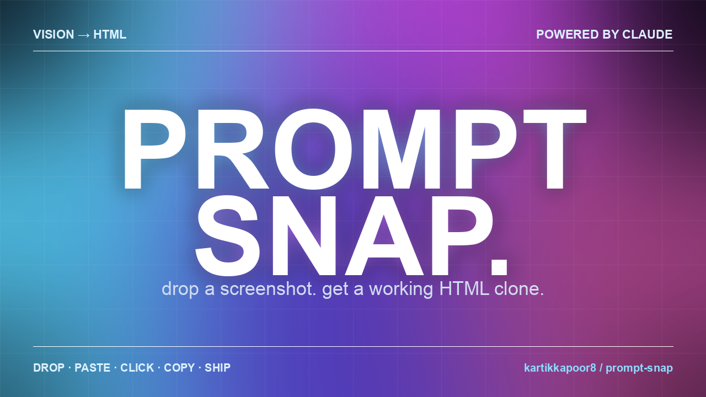

# prompt-snap

> **Drop a screenshot. Get a working HTML clone.**
> Vision-model-powered screenshot → single-file HTML/CSS, in one click.



[](https://vercel.com/new/clone?repository-url=https%3A%2F%2Fgithub.com%2FKartikkapoor8%2Fprompt-snap&env=ANTHROPIC_API_KEY&envDescription=Get%20your%20key%20from%20console.anthropic.com&project-name=prompt-snap&repository-name=prompt-snap)


---

## What it does

Drop, paste, or click a screenshot. The image goes to **Claude 3.5 Sonnet vision**, which returns a single self-contained HTML file with inline CSS. The file renders live in an iframe. Copy the code, download it, deploy it.

```
┌─────────────┐    base64    ┌──────────────┐   vision   ┌───────────┐
│  Browser    │ ───image───> │  /api/snap   │ ──────────>│  Claude   │
│ (drop zone) │ <── HTML ─── │ (Next route) │ <── HTML ──│  Sonnet   │
└─────────────┘              └──────────────┘            └───────────┘
       │
       ├─ live <iframe> preview
       ├─ copy-to-clipboard
       └─ download .html
```

## The prompt

The system prompt is intentionally strict — single-file output, semantic HTML, system fonts, inline CSS, no JavaScript, verbatim text transcription, no invented features. See [`app/api/snap/route.ts`](app/api/snap/route.ts) for the full system message.

## Features

- 🎯 **Drop · Paste · Click** — any of three ways to upload
- 🖼 **Live iframe preview** — instant visual diff against the original
- 📋 **Copy / Download** — single-file HTML, ready to ship
- 🔒 **Sandboxed render** — generated HTML runs in a sandboxed iframe
- 🎭 **Demo mode** — works without an API key for local UI work
- 🌑 **Brutalist B&W** — opinionated, monospace, zero filler

## Stack

Next.js 14 (App Router) · TypeScript · Tailwind · Anthropic SDK · Vercel-ready

## Quick start

```bash
git clone https://github.com/Kartikkapoor8/prompt-snap.git
cd prompt-snap
npm install
cp .env.example .env.local      # add your ANTHROPIC_API_KEY
npm run dev
```

Open `http://localhost:3000`. Drop a screenshot.

## Deploy

Hit the **Deploy with Vercel** button at the top. Paste your `ANTHROPIC_API_KEY` when prompted. You're live.

## Environment

| Variable | Required | Default | Notes |
|---|---|---|---|
| `ANTHROPIC_API_KEY` | yes\* | — | Get one at [console.anthropic.com](https://console.anthropic.com) |
| `CLAUDE_MODEL` | no | `claude-3-5-sonnet-latest` | Override to a different vision model |
| `DEMO_MODE` | no | auto | Set to `1` to force the canned demo response |

\* If `ANTHROPIC_API_KEY` is unset, the app silently falls back to demo mode so the UI still works for screenshots.

## Project layout

```
prompt-snap/
├── app/
│   ├── api/snap/route.ts   # Claude vision API call
│   ├── globals.css         # brutalist black-and-white
│   ├── layout.tsx
│   └── page.tsx            # the entire UI (one file, on purpose)
├── make_cover.py           # PIL script for the README cover
├── cover.png               # 1280×720 cover
├── next.config.mjs
├── tailwind.config.ts
├── tsconfig.json
├── .env.example
├── LICENSE
└── README.md
```

## Why

Frontend prototyping is bottlenecked on translating a screenshot into structure. Vision models removed that bottleneck. This is the smallest possible UI that exposes that capability — drop, get HTML, ship.

## Roadmap (ideas)

- [ ] Tailwind output mode (utility classes instead of inline CSS)
- [ ] React component output mode
- [ ] Multi-screenshot merge (whole-flow scaffolding)
- [ ] Side-by-side diff: original screenshot vs rendered clone
- [ ] Editable prompt — let users tune the system message live

## Author

[Kartik Kapoor](https://github.com/Kartikkapoor8)

## License

MIT
